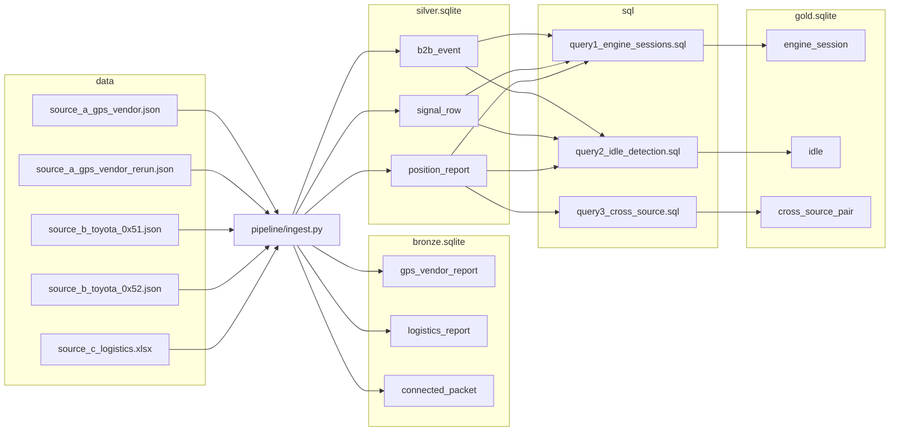

# Harborline telemetry

Harborline turns vehicle telemetry from three different feeds into one local analytics model, then answers a few fleet questions in SQL.

Start at [Assignment index](#assignment-index) to find each answer.

## Objective

Ingest every sample file into a single position model that can be queried across fleets, while keeping each feed's extra fields and the connected-vehicle event history intact.

## What this repo does

1. Defines the tables and records how each source field lands.
2. Runs a local Python pipeline that reads the files, checks them, skips bad rows, and loads SQLite without creating duplicates on a rerun.
3. Answers three questions in SQL on top of that database: engine sessions, long idle, and positions that disagree across feeds.

## Goal

A teammate can run the pipeline twice on the same files, see the second run insert nothing, and use the SQL to explain a fleet question without knowing which feed a row came from.

## Challenge

The three feeds do not share a shape, a clock, or a vehicle id.

- The GPS vendor file is one JSON object. A second file repeats those same bytes under another name.
- The connected-vehicle feed sends two packet types. One packet is an engine-on snapshot. The other is a heartbeat plus about sixty per-second entries of signals, and the battery voltage sits under a different key than the other signals.
- The logistics feed is a spreadsheet with its own column names and its own vehicle labels.
- Timestamps arrive in three formats. Some clocks sit in 2025 and one sits in 2026.
- Engine sessions have to survive a missing engine-off, two engine-on events in a row, and timestamps that arrive out of order.
- The sample set has no shared vehicle id, so a cross-feed position check may have nothing to flag. The query still has to be right.

## Deliver

```
README.md                          index, architecture, assumptions, decisions, limitations, FAQ
schema/bronze.sql                  raw landing tables
schema/silver.sql                  typed position, event, and signal tables
schema/gold.sql                    answer tables, filled by the three SQL scripts
schema/field_mapping.md            source field to silver column, and what was left out
pipeline/                          Python ingestion, entry point ingest.py
sql/query1_engine_sessions.sql     engine sessions
sql/query2_idle_detection.sql      idle longer than 30 minutes
sql/query3_cross_source.sql        positions that disagree across sources
tests/                             schema, ingest, and gold tests
docs/                              runbook, pipeline guide, glossary, trial log
data/                              the sample extracts
```

The three databases are attached as `bronze`, `silver`, and `gold`. Files live under `output/` and stay untracked.

## Assignment index

Each requirement of the assignment is listed below with a one-line answer and the place that shows it.

### Part 1: data modeling

| Requirement | Answer | Where |
|---|---|---|
| One table answers cross-fleet questions, such as vehicles over 80 km/h, regardless of source | `silver.position_report` holds one row per position for all three sources. | [schema/silver.sql](schema/silver.sql), [Decisions](#decisions) |
| Every record keeps its source lineage | `source_system` and `source_file` are on every bronze and silver table. | [schema/bronze.sql](schema/bronze.sql), [schema/silver.sql](schema/silver.sql), [docs/glossary.md](docs/glossary.md) |
| Sources provide different fields | A field that a source lacks is a nullable column that stays `NULL` for that source. | [schema/silver.sql](schema/silver.sql), [schema/field_mapping.md](schema/field_mapping.md) |
| One timezone convention | Position and B2B event times are stored in UTC and in `Asia/Bangkok`, and signal timestamps are stored in UTC. | [Assumptions](#assumptions), [pipeline/quality.py](pipeline/quality.py) |
| DDL for the unified schema | The single schema file from the brief is split into three medallion files. | [schema/bronze.sql](schema/bronze.sql), [schema/silver.sql](schema/silver.sql), [schema/gold.sql](schema/gold.sql) |
| Field mapping per source, with reasons to include or exclude | Each source has a mapping table, and the "Excluded on purpose" section lists what was dropped and why. | [schema/field_mapping.md](schema/field_mapping.md) |
| Connected-vehicle events and the per-second stream are stored separately | Events go to `silver.b2b_event` and per-second signals go to `silver.signal_row`. | [schema/silver.sql](schema/silver.sql), [schema/field_mapping.md](schema/field_mapping.md) |

### Part 2: pipeline

| Requirement | Answer | Where |
|---|---|---|
| Read all three formats | The feed map declares the GPS vendor JSON, the connected-vehicle JSON packets, and the logistics xlsx, and the ingest command loads every matching file. | [pipeline/ingest.py](pipeline/ingest.py), [pipeline/mappings/feeds.toml](pipeline/mappings/feeds.toml) |
| Parse the nested connected-vehicle packet | The packet loader reads the header GPS, the B2B event block, and the contained-data list from paths declared in the feed map. | [pipeline/formats/packet.py](pipeline/formats/packet.py) |
| Validate Thailand bounds, negative speed, and future time | A record with missing or out-of-bounds coordinates, a negative speed, or a time after the run clock is rejected, using the bounds declared in the feed map. | [pipeline/quality.py](pipeline/quality.py), [pipeline/mappings/feeds.toml](pipeline/mappings/feeds.toml) |
| Log and skip bad records without crashing | A bad record is counted as skipped with its reason, and the run moves on to the next record and file. | [pipeline/ingest.py](pipeline/ingest.py), [tests/test_ingest.py](tests/test_ingest.py) |
| Deduplicate and rerun idempotently | Every table has a unique key on business columns and a clash counts as a skip, so the rerun file and a second run insert nothing. | [schema/silver.sql](schema/silver.sql), [pipeline/db.py](pipeline/db.py), [tests/test_ingest.py](tests/test_ingest.py) |
| Flatten the contained-data list into signal rows | Each signal becomes one `silver.signal_row` with `b2b_event_id`, `signal_name`, `signal_value`, and `signal_timestamp`. | [pipeline/formats/packet.py](pipeline/formats/packet.py) |
| Load the target schema | The pipeline writes `bronze.sqlite`, `silver.sqlite`, and `gold.sqlite` under `output/`. | [pipeline/db.py](pipeline/db.py), [docs/runbook.md](docs/runbook.md) |
| Log ingestion results | Each file prints one line with its name, `inserted=`, `skipped=`, and `errors=` followed by the skip reasons, or `-` when there are none. | [pipeline/tally.py](pipeline/tally.py) |
| Python only, structured for a teammate | The pipeline is plain Python, and each file has one job described in the pipeline guide. | [docs/pipeline.md](docs/pipeline.md) |

### Part 3: SQL

| Requirement | Answer | Where |
|---|---|---|
| Engine sessions with a missing OFF, a duplicate ON, and out-of-order times | The header comment states how each edge case is handled. | [sql/query1_engine_sessions.sql](sql/query1_engine_sessions.sql), [Decisions](#decisions) |
| Idle longer than 30 minutes | Consecutive connected-vehicle positions at speed 0 inside an engine-on window are kept when the span lasts longer than 30 minutes. | [sql/query2_idle_detection.sql](sql/query2_idle_detection.sql), [Decisions](#decisions) |
| Cross-source positions more than 1 km apart within 5 minutes | The latest position per vehicle and source is paired across sources and flagged when the haversine distance is over 1 km. | [sql/query3_cross_source.sql](sql/query3_cross_source.sql), [Decisions](#decisions) |
| Edge cases the samples cannot produce | A test fixture adds a duplicate ON, a missing OFF, a 40-minute idle span, and a shared vehicle across two sources. | [tests/test_gold.py](tests/test_gold.py), [Limitations](#limitations) |

### Notes from the brief

| Requirement | Answer | Where |
|---|---|---|
| Document assumptions, data issues found, and how they were handled | The assumptions and limitations are below, the field mapping explains dropped fields, and the trial log records what failed and what replaced it. | [Assumptions](#assumptions), [Limitations](#limitations), [schema/field_mapping.md](schema/field_mapping.md), [docs/trial-log.md](docs/trial-log.md) |
| Architecture sketch | A diagram shows the ingest command writing bronze and silver from the sample files, and the SQL scripts writing gold. | [Architecture](#architecture) |

## Architecture



The model is three SQLite files under `output/`, attached as the schemas `bronze`, `silver`, and `gold`. The ingest command parses each record once and writes its bronze and silver rows in the same pass. The SQL scripts read silver and write gold.

## Assumptions

- A clock with no offset is `Asia/Bangkok`. UTC is stored beside that local time.
- A missing number is `NULL`. A blank in bronze is `''`.
- A source `Y` or `N` becomes `1` or `0`.
- A connected-vehicle `vehicle_id` stays `''` when the packet has no plate.
- No shared vehicle id is invented across feeds.
- Thailand bounds are latitude 5.6 to 20.5 and longitude 97.3 to 105.7. A position outside them is skipped.
- A negative speed drops the whole record.
- A timestamp is in the future when its UTC event time is after the run clock. That record is skipped.

## Decisions

- The medallion is physical: three SQLite files.
- Bronze stays text. A connected packet is stored as `packet_type` plus the raw payload.
- Silver holds the typed position, event, and signal tables. B2B events and signal rows stay out of `position_report`.
- Gold holds answer rows only. Each script runs `DELETE` and then `INSERT ... SELECT`, so a rerun does not double rows.
- Unique keys use business columns. Source file and load timestamps are left out of them. Dedup is that unique key, so the byte-identical GPS rerun inserts nothing.
- Engine sessions sort events by time first. A repeated ON moves the start to the later ON and sets `repeated_on_flag`. An ON with no OFF within 24 hours stays open with `missing_off_flag` 1. Heartbeat type 30 does not open or close a session.
- Session distance is the maximum minus the minimum of `Total Distance Traveled` in the window. One reading gives 0.
- Fuel is `Vehicle Fuel Rate` (L/hr) times the gap to the next reading. The last reading adds 0.
- Idle is source B only. A span is consecutive position reports with `speed_kmh = 0` inside an engine-on window, kept when it lasts longer than 30 minutes. A NULL or non-zero speed ends the span.
- Cross-source ignores an empty `vehicle_id`. It takes the latest position per vehicle and source, and pairs sources so `source_system_left` sorts before `source_system_right`. A pair is kept when the two times are within 5 minutes, and `disagree_flag` is 1 when the haversine distance is over 1 km.

## Limitations

- On these samples gold holds one open engine session with an empty `vehicle_id` and `missing_off_flag` 1, zero idle rows, and zero cross-source pairs.
- The samples have no event type 34, no idle span longer than 30 minutes, and no vehicle id shared across feeds.
- Connected-vehicle B2B events carry no vehicle id. A session takes `vehicle_id` from the position report loaded from the same file.
- `Engine RPM List` and `Vehicle speed List` are excluded. GPS vendor display text and the three temperature channels are excluded too. `schema/field_mapping.md` gives the reasons.
- A fixture in `tests/test_gold.py` exercises the edge cases the samples lack.

## FAQ

**Where are the `.sqlite` files?**
They are under `output/`, which is gitignored. Run ingest to create them. The tests use a temporary directory and leave nothing behind. See [docs/runbook.md](docs/runbook.md).

**How do I run everything?**
Run ingest, then the gold `sqlite3` command, then the tests. The commands are in [docs/runbook.md](docs/runbook.md).

**Why are `idle` and `cross_source_pair` empty?**
The samples have no idle span longer than 30 minutes and no vehicle id shared across feeds. The queries still produce rows on the fixture in [tests/test_gold.py](tests/test_gold.py). See [Limitations](#limitations).

**Why is there no `unified_schema.sql`?**
The schema is split into [schema/bronze.sql](schema/bronze.sql), [schema/silver.sql](schema/silver.sql), and [schema/gold.sql](schema/gold.sql). The unified table is `silver.position_report`.

**Why is `vehicle_id` empty for connected-vehicle rows?**
The sample packet has no plate, so `vehicle_id` stays `''`. See [schema/field_mapping.md](schema/field_mapping.md).

**How do I check that a rerun inserts nothing?**
Run ingest twice and compare the log lines. Every line on the second run shows `inserted=0`, which [tests/test_ingest.py](tests/test_ingest.py) asserts.

## Python

Setup and run commands live in [docs/runbook.md](docs/runbook.md).

## Samples

| File | What it is |
|---|---|
| `data/source_a_gps_vendor.json` | Latest position from a GPS vendor |
| `data/source_a_gps_vendor_rerun.json` | Same payload as the file above, under another name |
| `data/source_b_toyota_0x51.json` | Periodic packet: one event snapshot plus a per-second signal stream |
| `data/source_b_toyota_0x52.json` | Engine-on packet: event snapshot only |
| `data/source_c_logistics.xlsx` | Flat GPS track from a logistics fleet |

## License

The code in this repository is © devruji. All rights reserved. The files in `data/` are sample extracts supplied for this exercise and are not covered by any license here.
